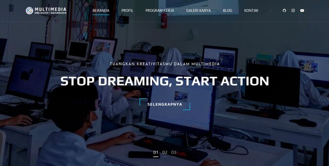

# Selamat Datang di Repositori Multimedia

Ini adalah repositori untuk Ekstrakurikuler Multimedia kami di SMA Negeri 1 Baturraden. Rencananya laman web [multimediaa.github.io](https://multimediaa.github.io) akan digunakan sebagai portofolio yang menampilkan galeri karya dari anggota ekskul kami.

Selain itu, laman blog juga akan digunakan untuk berbagi pengetahuan mulai dari tips dan tutorial mengenai program kerja kami. Kami juga masih pemula dalam bidang pemrograman. Makanya ini bisa menjadi pembelajaran dan latihan.

Nah, jika kamu tertarik untuk menjelajahi karya-karya kami, silahkan kunjungi laman web kami :D

## Penerimaan Anggota Baru

Setiap tahun, Multimedia membuka penerimaan anggota baru. Kunjungi media sosial kami untuk info lebih lanjut!

- [Instagram](https://www.instagram.com/multimedia_smabara/)
- [Youtube](https://www.youtube.com/@multimediasmabara7785)

## Kredit dan Lisensi

  
<strong>Kredit</strong>

* Videograph by [Colorlib](https://colorlib.com).
* Penggunaan Icons: 
[Flaticon](https://www.flaticon.com),
[Elegant Icons](https://www.elegantthemes.com/blog/resources/elegant-icon-font), dan
[Font Awesome](https://fontawesome.com).

 

  
<strong>Lisensi</strong>

  Kami menggunakan template Videograph yang diunduh secara gratis di <a href="https://themewagon.com/license">ThemeWagon</a> dan dapat digunakan untuk keperluan pribadi & komersial.

